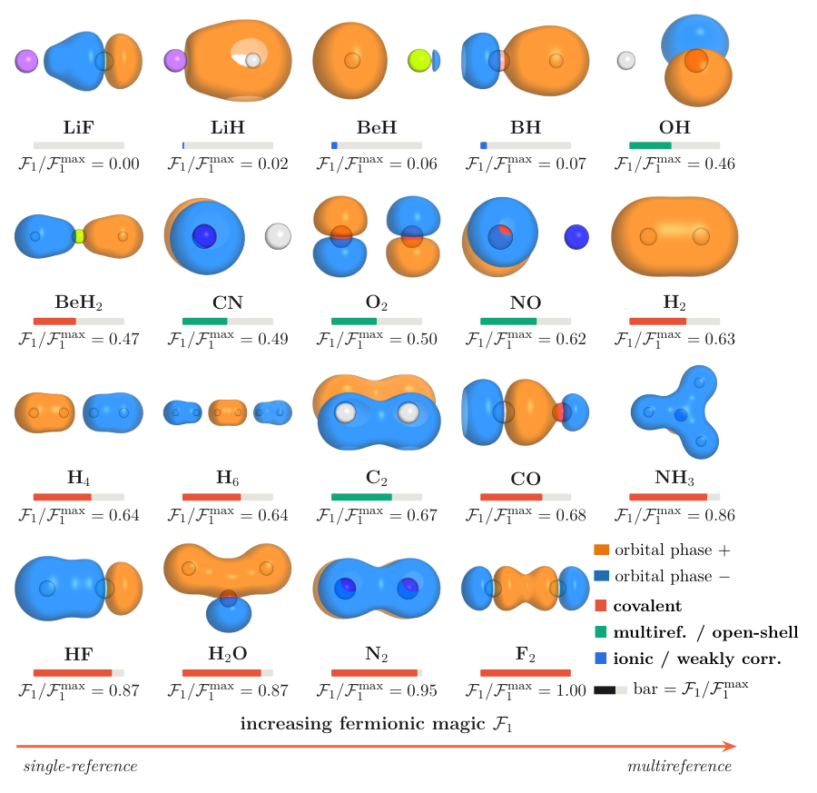

<div align="center">

# Dynamical spectral functions from bitstring-sampled quantum subspaces
### *entanglement, not one-body magic, tracks the sampling cost*

**Nicolás Bonilla Vargas** &nbsp;[](https://orcid.org/0009-0006-6155-4391)

[](https://arxiv.org/abs/XXXX.XXXXX)
[](paper/main.pdf)
[](LICENSE)
[](LICENSE)
[](requirements.txt)
[](docs/REPRODUCE.md)

</div>

> **One sentence.** We lift sample-based quantum diagonalization (SQD/QSCI) from the ground-state *energy*
> to *dynamical* spectral functions — `A(ω)`, `A(k,ω)`, `S(q,ω)`, `S^zz(q,ω)` — reconstructed from purely
> bitstring-sampled subspaces, and prove that the one-body fermionic magic `F₁` is **decoupled** from the
> sampling cost `|S|`, which is instead **lower-bounded and empirically tracked** by the entanglement
> (minimal bond dimension `χ`).

This repository is the **complete, reproducible record** of the paper. Every number, figure, and claim
traces to a script and a data file listed in [`docs/REPRODUCE.md`](docs/REPRODUCE.md) and
[`docs/FILE_INDEX.md`](docs/FILE_INDEX.md). A referee can regenerate every non-hardware result from source.

---

## Figure gallery

| Momentum-resolved `A(k,ω)` (exact Mott map) | The resource thesis (74 exact states) |
|:---:|:---:|
|  |  |
| **Charge structure factor `S(q,ω)` — gapped** | **Spin structure factor `S^zz(q,ω)` — gapless** |
|  |  |
| **Scaling: fraction falls, absolute cost grows** | **IBM Heron hardware (two real runs)** |
|  |  |
| **Nineteen-molecule magic gallery** | **N₂ dissociation hero (`F₁ = 2Nᵤ`)** |
|  |  |

<div align="center"><em>The two collective channels come from the <strong>same sampling primitive</strong>: the
<strong>spin–charge separation</strong> of the 1D Mott insulator — charge gapped (Δ≈5t), spin gapless (πJ/2≈0.79t).</em></div>

---

## What the paper shows

1. **A new use of the sampled-subspace toolkit** — frequency-resolved dynamical response from
   bitstring-sampled subspaces (charged `(N±1)` single-particle spectra and neutral-`N` structure
   factors), with **no Hadamard tests or controlled unitaries**. Validated against exact diagonalization
   on Hubbard chains and across a **nineteen-molecule suite** (energies FCI-verified to `<10⁻⁵` Ha), and
   demonstrated on the **IBM Heron** processor.
2. **The resource that sets the cost — and the one that does not.** The fermionic AntiFlatness collapses
   to a single 1-RDM invariant `F₁ = 4 tr[γ(1−γ)] = 2Nᵤ`. Being an orbital-rotation (Gaussian) invariant,
   it is **provably decoupled** from the basis-dependent support `|S|`; the cost is instead lower-bounded
   and empirically tracked by the bond dimension `χ` (Spearman `ρ = 0.90`). No quantum-advantage claim is
   made — the open question is relocated, not settled.

**Headline hardware number:** stretched N₂ on `ibm_marrakesh` reaches **0.59 ± 0.14 mHa** of exact FCI via
noise-assisted configuration recovery (the same shallow circuit gives 29.5 mHa in noiseless simulation).

---

## Repository structure

```
.
├── src/                       # 43 computation & figure scripts (run from repo root as `python src/X.py`)
│   ├── verify.py              #   fast numpy/scipy-only reproducibility check (what CI runs)
│   ├── akw_lanczos.py …       #   exact-diagonalization engines + spectral/resource/scaling compute
│   └── make_*.py              #   one data-driven figure generator per figure (no hand-typed numbers)
├── data/                      # authoritative data: every plotted number, FCI-verified (*.json)
├── notebooks/
│   ├── 00_Reproduce_Everything.ipynb   #   ★ MASTER notebook: reproduces every figure & number, end to end
│   ├── HW_LUCJ_N2_Heron_READY.ipynb    #   IBM Heron N₂ energy   (token SCRUBBED — see below)
│   └── Spectral_Heron.ipynb            #   IBM Heron A(ω)        (token SCRUBBED — see below)
├── paper/                     # arXiv-ready LaTeX source + compiled PDF
│   ├── main.tex               #   master file (\input's the sections below)
│   ├── introduction.tex … conclusion.tex, theorem_b2.tex, bibliography.tex
│   ├── figs/                  #   figure fragments (.tex), vector PDFs, plotted data (.dat)
│   ├── main.pdf               #   the compiled preprint (39 pp)
│   └── arxiv-submission.tar.gz#   ready-to-upload source bundle
├── docs/
│   ├── REPRODUCE.md           #   figure/number → script → exact command
│   ├── FILE_INDEX.md          #   every file, described
│   ├── FIGURE_PROVENANCE.md   #   figure → data-source → job-id single source of truth
│   └── img/                   #   README thumbnails
├── requirements.txt           # Python dependencies
├── Makefile                   # `make verify`, `make figures`, `make reproduce`, `make paper`
├── CITATION.cff               # citation metadata
└── LICENSE                    # MIT (code) + CC-BY-4.0 (paper text/figures)
```

---

## Quick start

```bash
# 1. environment
python -m venv .venv && source .venv/bin/activate      # (Windows: .venv\Scripts\activate)
pip install -r requirements.txt

# 2. reproduce headline numbers in SECONDS (numpy/scipy only): F₁(L=6)=9.3851 + the geminal witness
python src/verify.py        # or: make verify   ->   all PASS

# 3. reproduce EVERYTHING in one coherent, narrated pass — every figure and number, top to bottom
jupyter notebook notebooks/00_Reproduce_Everything.ipynb    # or headless: make reproduce

# 4. regenerate a single data-driven figure fragment from its committed data
python src/make_decoupling_native.py    # -> paper/figs/fig_decoupling_native.tex

# 5. build the paper (needs a TeX distribution, e.g. TeX Live / MiKTeX)
make paper                              # -> paper/main.pdf
```

**Posting to arXiv?** The upload-ready bundle `paper/arxiv-submission.tar.gz` compiles clean-room with
`pdflatex` alone (39 pp, 0 undefined refs) — see **[`docs/ARXIV_SUBMISSION.md`](docs/ARXIV_SUBMISSION.md)**
for the verification, metadata, and step-by-step.

The **master notebook** [`notebooks/00_Reproduce_Everything.ipynb`](notebooks/00_Reproduce_Everything.ipynb)
walks the whole pipeline end to end — the decoupling identity and witness, the sampled spectral functions,
the χ–\|S\| resource map, the scaling, the 19-molecule magic suite, the selector/noise/AI results, the
hardware run, and the figures — each number loaded from the same `data/*.json` that feeds the paper.
Every figure's one-line reproduce command is in **[`docs/REPRODUCE.md`](docs/REPRODUCE.md)**.

---

## Reproducibility at a glance

| Layer | Reproducible here? | How |
|---|---|---|
| **Everything, one coherent pass** | ✅ narrated, end to end | `notebooks/00_Reproduce_Everything.ipynb` (or `make reproduce`) |
| **Exact diagonalization** (all `A(ω)`, `A(k,ω)`, `S(q,ω)`, `S^zz`, the 19-molecule magic suite, the χ–\|S\| resource map, the geminal witness) | ✅ fully, locally | `python src/<script>.py`; see `docs/REPRODUCE.md` |
| **Matrix-free scaling** to 28 qubits | ✅ (RAM-staged) | `src/scaling_lanczos_mf.py` (resumable, checkpointed) |
| **Figures** | ✅ fully | `make figures` (native pgfplots from the `data/*.json`/`.dat`) |
| **IBM Heron hardware runs** | ⚠️ needs an IBM Quantum account | `notebooks/` (cached counts + a re-run cell; tokens scrubbed) |

The two hardware runs are the **entirety** of the quantum hardware used; every other result is an exact
classical simulation reproducible from this repository.

---

## 🔒 Security note (please read before pushing)

The hardware notebooks in `notebooks/` have had the author's **IBM Quantum API token and instance CRN
removed** and replaced with `<YOUR_IBM_QUANTUM_TOKEN>` / `<YOUR_IBM_QUANTUM_INSTANCE_CRN>` placeholders.
To run them, insert **your own** credentials (never commit them — use `QiskitRuntimeService.save_account`
locally or an environment variable). This repository contains **no secrets**.

---

## Citation

If you use this work, please cite it (see [`CITATION.cff`](CITATION.cff)):

```bibtex
@article{BonillaVargas2026DynamicalSpectral,
  title   = {Dynamical spectral functions from bitstring-sampled quantum subspaces:
             entanglement, not one-body magic, tracks the sampling cost},
  author  = {Bonilla Vargas, Nicol\'as},
  journal = {arXiv preprint arXiv:XXXX.XXXXX},
  year    = {2026}
}
```

## License

- **Code** (`*.py`, `notebooks/`, `Makefile`): [MIT](LICENSE).
- **Paper text and figures** (`paper/`): [CC-BY-4.0](LICENSE).
