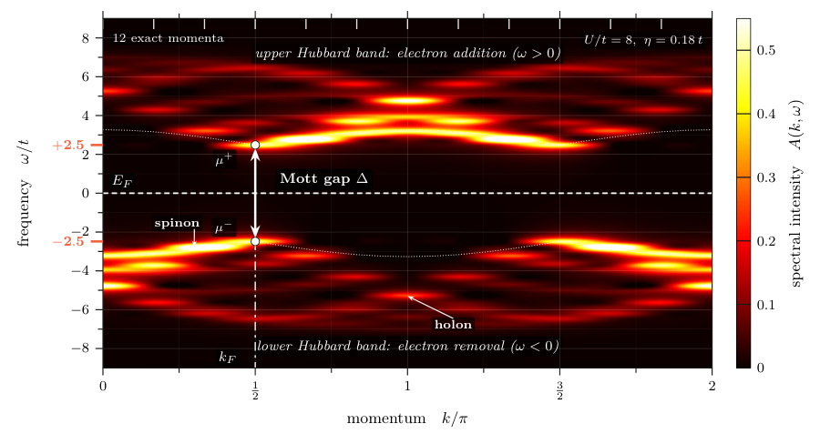
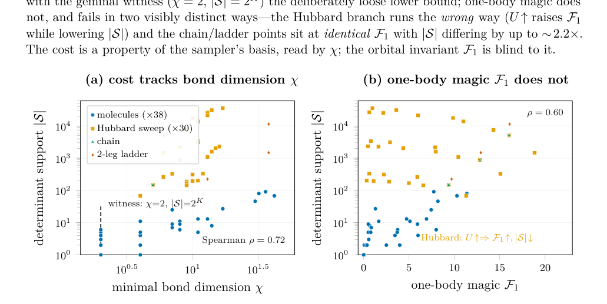
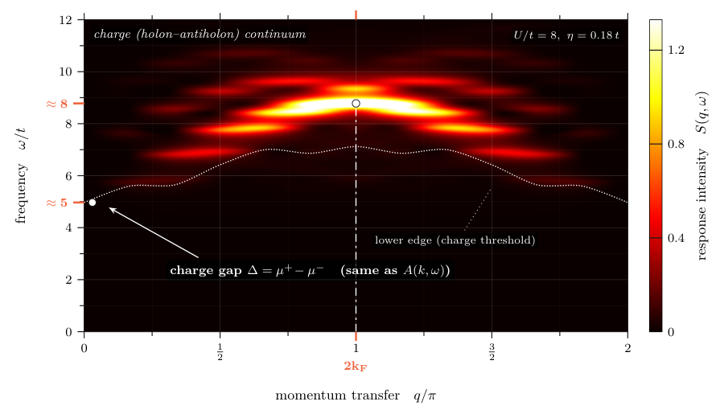
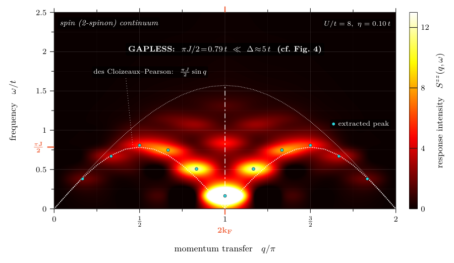
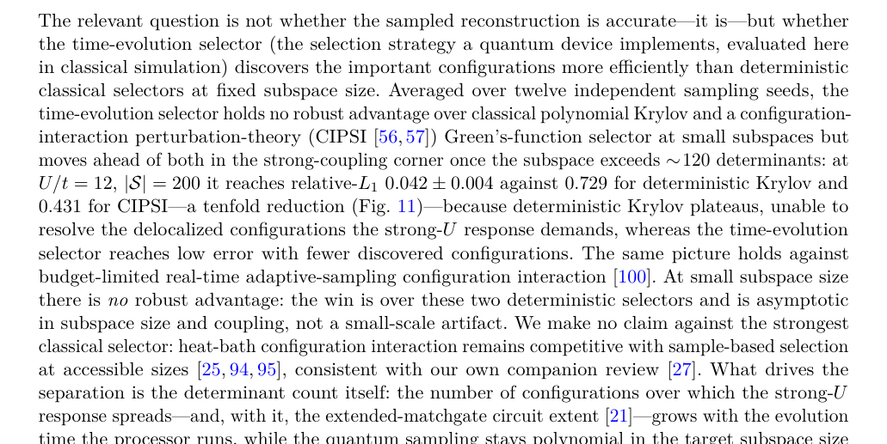
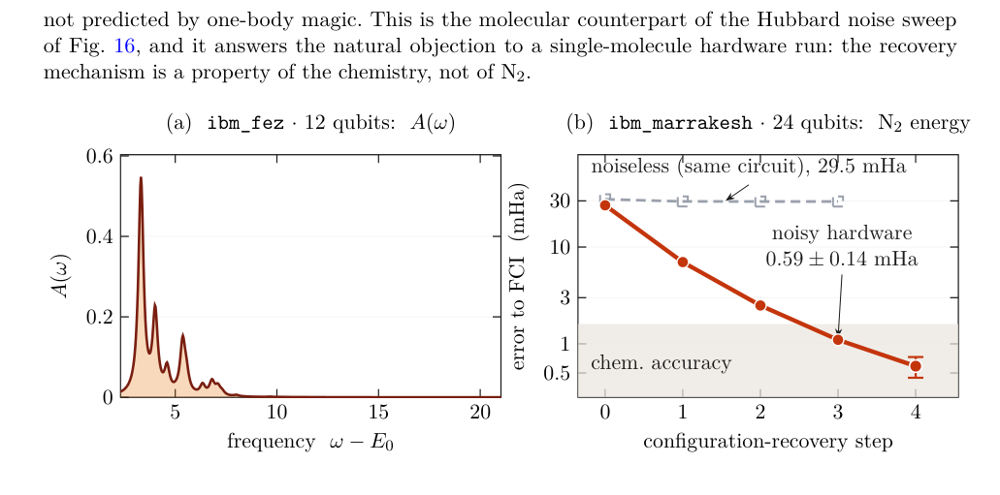
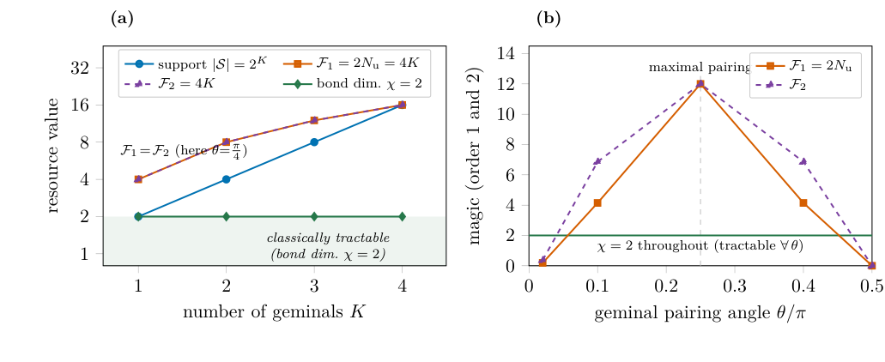
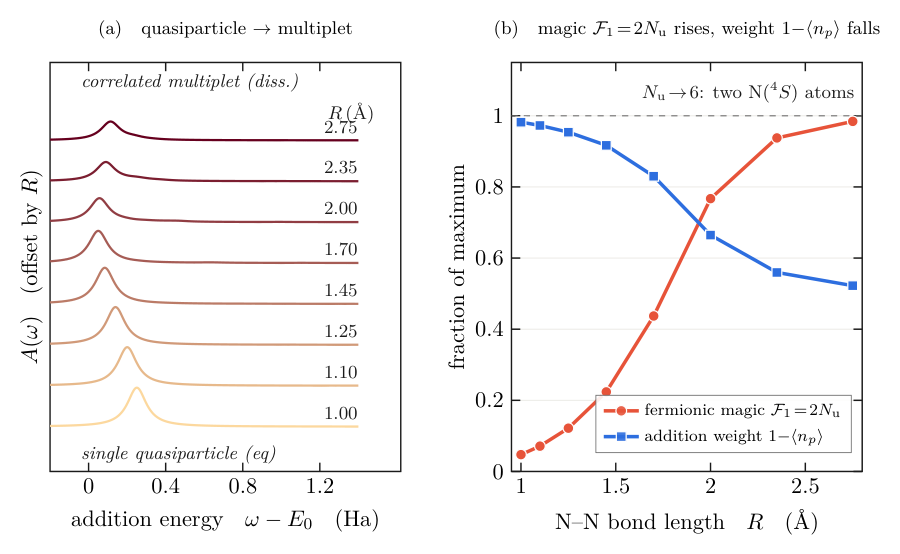

<div align="center">

# Captured weight and boundary leakage bound the error of sample-based spectral functions

### *a two-sided, a posteriori bound — and an honest account of where it is vacuous*

**Nicolás Bonilla Vargas** &nbsp;[](https://orcid.org/0009-0006-6155-4391)

[](https://arxiv.org/abs/2608.16436)
[](paper/main.pdf)
[](LICENSE)
[](LICENSE)
[](https://github.com/nicolasbonilla/dynamical-spectral-functions-sqd)
[](requirements.txt)
[](docs/REPRODUCE.md)

</div>

> **One sentence.** Sample-based quantum diagonalization is moving from energies to dynamics; given the
> subspace the shots populated, we prove a **two-sided bound on the relative `L₁` error** of the
> spectral function built on it — at least `1−w`, at most `(1+√w)(√(1−w) + Λ̂(η)/η)`, with `w` the
> captured Born weight and `Λ̂` the normalized coupling of `H` across the subspace boundary at
> resolution `η`, computable from the Ritz vectors in hand. **Shots buy the first term down, not the
> second.**

> **And the retraction, in the same breath.** Versions 1–2 of this preprint claimed a *weight-only*
> bound. An analytic counterexample forces its constant to the trivial value, and it is **withdrawn**.
> On Hubbard sectors up to dimension 731 808 the replacement is worse than the trivial bound at every
> published fraction, at all four sizes, by factors of 2.8–4.9 — **so those reconstructions are
> uncertified**. What survives is a calibration: over sixteen `(L,η)` cells whose true errors span five
> decades, the bound crosses the trivial one at a true relative error of `1.2–7.3×10⁻³`, median
> `2.8×10⁻³`, computed without the answer. **No quantum advantage is claimed.**

**Repository:** <https://github.com/nicolasbonilla/dynamical-spectral-functions-sqd> — this URL is the
one the manuscript's data-availability statement points to. It is also in
[`CITATION.cff`](CITATION.cff).

This repository is the **reproduction record** of the paper: every number and every figure traces to a
script and a data file listed in [`docs/REPRODUCE.md`](docs/REPRODUCE.md) and
[`docs/FILE_INDEX.md`](docs/FILE_INDEX.md), and `python src/verify.py` recomputes the physics and checks
the deposit against it. **It is not a claim that everything re-runs here.** What a clean clone reaches —
and the parts it does not, because they need `pyscf`, an IBM Quantum account, or a figure source that is
not deposited — is tabulated, measured rather than asserted, at the end of
[`docs/REPRODUCE.md`](docs/REPRODUCE.md), and the gaps are enumerated in
[`docs/KNOWN_DISCREPANCIES.md`](docs/KNOWN_DISCREPANCIES.md). The statement that may be published about
all this is [`docs/DATA_AVAILABILITY.md`](docs/DATA_AVAILABILITY.md).

> **Companion works.** Review — *Machine learning for sample-based quantum diagonalization: generative
> configuration recovery and the classical-simulability frontier* ([arXiv:2608.05314](https://arxiv.org/abs/2608.05314)).
> Method — *Self-falsifying quantum spectroscopy: a transportable necessary-condition screen for
> quantum-computed dynamical spectra* (companion, arXiv posting in progress).

---

## Figure gallery

| Momentum-resolved `A(k,ω)` (exact Mott map) | The resource thesis (74 exact states) |
|:---:|:---:|
|  |  |
| **Charge structure factor `S(q,ω)` — gapped** | **Spin structure factor `S^zz(q,ω)` — gapless** |
|  |  |
| **Scaling: fraction falls, absolute cost grows** | **IBM Heron hardware (two real runs)** |
|  |  |
| **The geminal witness: magic large, `χ = 2`** | **N₂ dissociation hero (`F₁ = 2Nᵤ`)** |
|  |  |

<div align="center"><em>The two collective channels come from the <strong>same sampling primitive</strong>: the
<strong>spin–charge separation</strong> of the 1D Mott insulator — charge gapped (Δ≈5t), spin gapless (πJ/2≈0.79t).</em></div>

---

## What the paper shows

1. **A two-sided, a posteriori error bound for sampled spectral functions.** One sampling primitive,
   four channels — `A(ω)`, `A(k,ω)`, `S(q,ω)`, `S^zz(q,ω)` — with **no Hadamard tests or controlled
   unitaries**, and a certificate computed from the Ritz vectors the run already produced. The upper
   branch splits the error into what shots can fix (captured weight `1−w`) and what they cannot
   (boundary leakage `Λ̂(η)/η`).
2. **A retraction, and what replaces it.** The weight-only bound of versions 1–2 is withdrawn: an
   analytic counterexample forces its constant to the trivial value, and none of 606 test subspaces
   violates the replacement. The obstruction is structural — at `L=8` the probe's Krylov space touches
   every determinant of the sector.
3. **An obstruction theorem for one-body magic.** The fermionic AntiFlatness collapses to a single
   1-RDM invariant `F₁ = 4 tr[γ(1−γ)] = 2Nᵤ`. Being an orbital-rotation (Gaussian) invariant, it is
   **provably decoupled** from the basis-dependent support `|S|`: constant along an orbit on which the
   support runs from `O(K)` to `2^K` at bond dimension 2. Within each of six `(L,N)` strata its rank
   correlation with the support is exactly `−1` (exact `p = 3.3×10⁻¹³`); **both pooled coefficients are
   withdrawn** as a Simpson reversal.
4. **Validation, measured prices, and hardware.** Exact diagonalization across Hubbard chains and a
   nineteen-molecule suite; the three prices (support, resolution, shots) measured rather than
   asserted; and two real **IBM Heron** runs.

**Headline hardware number:** stretched N₂ on `ibm_marrakesh` reaches **0.59 ± 0.14 mHa** of exact FCI
via noise-assisted configuration recovery (the same shallow circuit gives 29.5 mHa in noiseless
simulation).

---

## Repository structure

```
.
├── src/                       # 57 computation & figure scripts (run from repo root as `python src/X.py`)
│   ├── verify.py              #   the adversarial guardian: recomputes the physics, then checks the deposit
│   ├── check_figures.py       #   do the committed generators still produce the committed fragments?
│   ├── check_provenance.py    #   does the documentation still describe the manuscript? (derives it from main.tex)
│   ├── akw_lanczos.py …       #   exact-diagonalization engines + spectral/resource/scaling compute
│   └── make_*.py              #   one data-driven figure generator per figure (no hand-typed numbers)
├── data/                      # 37 authoritative datasets: every plotted number (*.json)
├── notebooks/
│   ├── 00_Reproduce_Everything.ipynb   #   ★ MASTER notebook (needs pyscf)
│   ├── HW_LUCJ_N2_Heron_READY.ipynb    #   IBM Heron N₂ energy   (token SCRUBBED — see below)
│   └── Spectral_Heron.ipynb            #   IBM Heron A(ω)        (token SCRUBBED — see below)
├── paper/                     # the v3 manuscript: REVTeX 4.2, two columns, Physical Review A
│   ├── main.tex               #   preamble, abstract and the \input list
│   ├── sec_1.tex … sec_10.tex #   the ten body sections
│   ├── sec_*_app.tex, app_*.tex#  the seven appendices
│   ├── carried/               #   nine one-float wrappers carried verbatim from v2
│   ├── figs/                  #   11 native fragments, 6 figure PDFs, 19 plotted .dat tables, captions
│   ├── main.pdf               #   the compiled preprint (59 pp)
│   └── arxiv-submission.tar.gz#   the FROZEN arXiv v2 bundle — a record, never a source
├── _superseded/               # the v2 manuscript and the five figures v3 withdrew, kept for the trail
├── docs/
│   ├── REPRODUCE.md           #   figure/number → script → exact command, and what a clean clone cannot reach
│   ├── FILE_INDEX.md          #   every file, described, plus the orphan inventory
│   ├── FIGURE_PROVENANCE.md   #   figure → source → generator → data → job id
│   ├── KNOWN_DISCREPANCIES.md #   where running a script does NOT reproduce the deposit (read this)
│   ├── DATA_AVAILABILITY.md   #   the statement drafted for PRA, and the audit behind each sentence
│   └── img/                   #   README thumbnails
├── requirements.txt           # Python dependencies
├── Makefile                   # `make verify`, `make check-figures`, `make figures`, `make paper`, `make ci`
├── CITATION.cff               # citation metadata
└── LICENSE                    # MIT (code) + CC-BY-4.0 (paper text, figures and data)
```

---

## Quick start

```bash
# 1. environment
python -m venv .venv && source .venv/bin/activate      # (Windows: .venv\Scripts\activate)
pip install -r requirements.txt

# 2. the adversarial guardian (~10 s, numpy/scipy only). It RECOMPUTES the physics
#    (Hubbard F₁/E₀ for both boundary conditions, the geminal witness) and then checks every
#    deposited artefact — figures, tables, .dat files and the abstract — against it.
python src/verify.py        # or: make verify   ->   PASS, plus a named list of open defects
#    It exits non-zero and names the defect if anything disagrees. The `[XFAIL]` lines it
#    prints are REAL open defects, claims and coverage gaps, deliberately visible.

# 2b. do the committed figures still come out of the committed generators? (see the caveat below)
python src/check_figures.py # or: make check-figures

# 2c. does the DOCUMENTATION still describe the manuscript? (derived from paper/main.tex)
python src/check_provenance.py          # add -v for the orphan inventory, --markdown for the table

# 3. reproduce everything in one narrated pass (needs pyscf)
jupyter notebook notebooks/00_Reproduce_Everything.ipynb    # or headless: make reproduce

# 4. regenerate a single data-driven figure fragment from its committed data
python src/make_decoupling_native.py    # -> paper/figs/fig_decoupling_native.tex

# 5. build the paper (needs a TeX distribution with REVTeX 4.2 and pgfplots ≥ 1.18)
make paper                              # -> paper/main.pdf
```

**Posting to arXiv?** See **[`docs/ARXIV_SUBMISSION.md`](docs/ARXIV_SUBMISSION.md)**. **`paper/arxiv-submission.tar.gz`
is the frozen snapshot of what was posted as v2 and must never be re-uploaded**:
17 files in `paper/` have since moved ahead of it and two more have been deleted from the tree, and
the bundle still contains the two fabricated rows of `figs/sqw_edges.dat` and the seven v2 body files
the v3 sections replace. Run `python src/check_tarball.py` for the live comparison, and see
[`docs/KNOWN_DISCREPANCIES.md`](docs/KNOWN_DISCREPANCIES.md) §7.

---

## Reproducibility at a glance

*Measured 2026-09-19 unless the row says otherwise.*

| Layer | Reproducible here? | How |
|---|---|---|
| **The guardian** | ✅ **PASS** — 807 checks, 0 failures, 7 454 numeric assertions, 4 xfail, 0 xpass, 2 skips, ~10 s *(2026-09-19)* | `python src/verify.py` (or `make verify`) |
| **The documentation** | ✅ **PASS** — derived from `paper/main.tex`: 33 floats, 17 figures, 16 tables | `python src/check_provenance.py` |
| **The figure generators** | ✅ **PASS on 8 artefacts, all 8 genuinely guarded** *(2026-09-19)*. Until that day the eighth was compared with a copy of itself, because its generator hard-coded two absolute paths; both are gone and the repair is measured, with controls, in `KNOWN_DISCREPANCIES.md` §25 | `python src/check_figures.py` |
| **Exact diagonalization, numpy/scipy only** (`A(ω)`, `A(k,ω)`, `S(q,ω)`, `S^zz`, the two gaps, the χ–\|S\| resource map, the geminal witness, the scaling) | ✅ **verified locally**, minutes | `python src/<script>.py`; see `docs/REPRODUCE.md` |
| **The 19-molecule suite** | ⚠️ runs, but needs `pyscf`; **untested in this pass**, so the molecular checks are transcription checks, not recomputations | `python src/n19_suite.py` etc. |
| **Everything, one coherent pass** | ⚠️ **not verified** — the master notebook needs `pyscf` | `notebooks/00_Reproduce_Everything.ipynb` |
| **Matrix-free scaling** to 28 qubits | ✅ (RAM-staged, resumable) | `src/scaling_lanczos_mf.py` |
| **Figures** | ⚠️ **6 of 17 are byte-for-byte guarded.** Eleven are not: four have no deposited generator, six ship as a PDF whose source is not deposited, and two (Figs. 10 and 17) name a generator that is not in the tree | inventory in [`docs/FIGURE_PROVENANCE.md`](docs/FIGURE_PROVENANCE.md) |
| **IBM Heron hardware runs** | ⚠️ needs an IBM Quantum account, and the jobs are closed | `notebooks/` (tokens scrubbed; **no raw counts are deposited**) |

> **`paper/main.pdf` is current.** Rebuilt 2026-09-19 with three `pdflatex` passes after the last
> source edit: **57 pages, 0 errors, 0 undefined references, 0 undefined citations, 6 Overfull
> \hbox**. Checked, not assumed: no file under `paper/` is newer than it, and its extracted text
> is identical page for page to an independent compile of the same sources made outside the
> repository (same 275 354 characters, same SHA-1). It now prints `R_eq(H₂O) = 0.958`, the value
> the geometry in `src/n19_suite.py` gives. Run `make paper` after any further source edit.
>
> **CI has still never run.** `.github/workflows/ci.yml` is tracked and both its commands pass
> locally, but the workflow cannot execute until the commit carrying it is **pushed**, and the four
> repair commits on local `main` are unpushed. `KNOWN_DISCREPANCIES.md` §24.

**Data availability:** the statement drafted for Physical Review A, and the audit of what the deposit
does and does not support, are in [`docs/DATA_AVAILABILITY.md`](docs/DATA_AVAILABILITY.md).

The two hardware runs are the **entirety** of the quantum hardware used; every other result is an exact
classical simulation reproducible from this repository.

---

## 🔒 Security note (please read before pushing)

The hardware notebooks in `notebooks/` have had the author's **IBM Quantum API token and instance CRN
removed** and replaced with `<YOUR_IBM_QUANTUM_TOKEN>` / `<YOUR_IBM_QUANTUM_INSTANCE_CRN>` placeholders.
To run them, insert **your own** credentials (never commit them — use `QiskitRuntimeService.save_account`
locally or an environment variable). This repository contains **no secrets**.

---

## Citation

If you use this work, please cite it (see [`CITATION.cff`](CITATION.cff)):

```bibtex
@article{BonillaVargas2026CapturedWeight,
  title   = {Captured weight and boundary leakage bound the error of
             sample-based spectral functions},
  author  = {Bonilla Vargas, Nicol\'as},
  journal = {arXiv preprint arXiv:2608.16436},
  year    = {2026}
}
```

## License

- **Code** (`*.py`, `notebooks/`, `Makefile`): [MIT](LICENSE).
- **Paper text, figures and data** (`paper/`, `data/`): [CC-BY-4.0](LICENSE).
