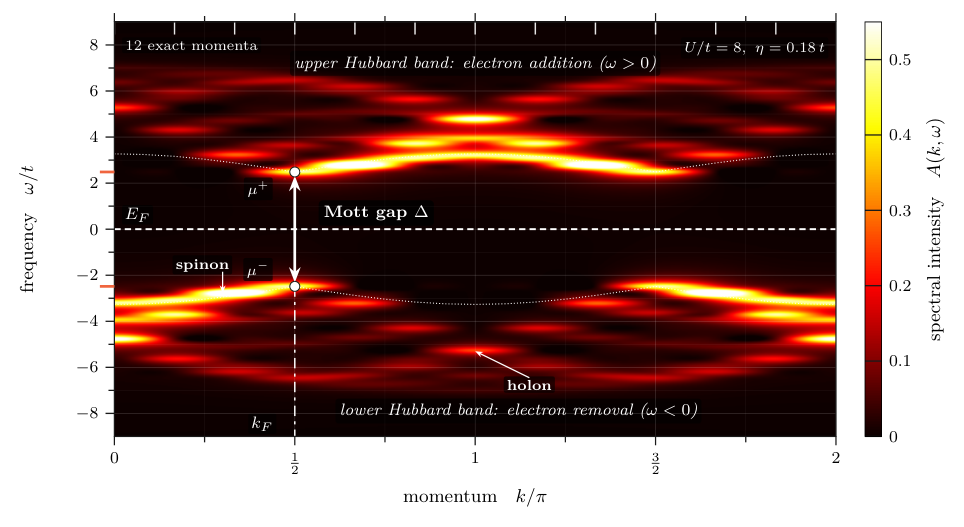
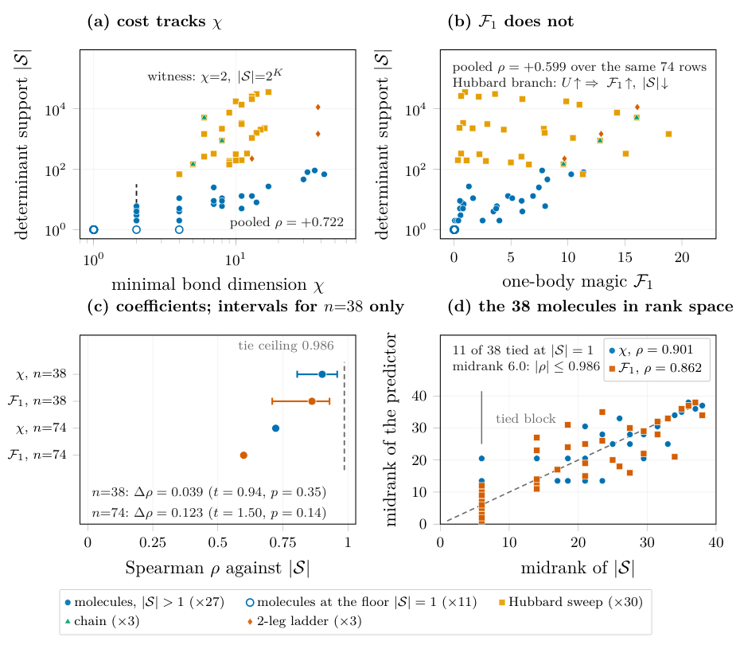
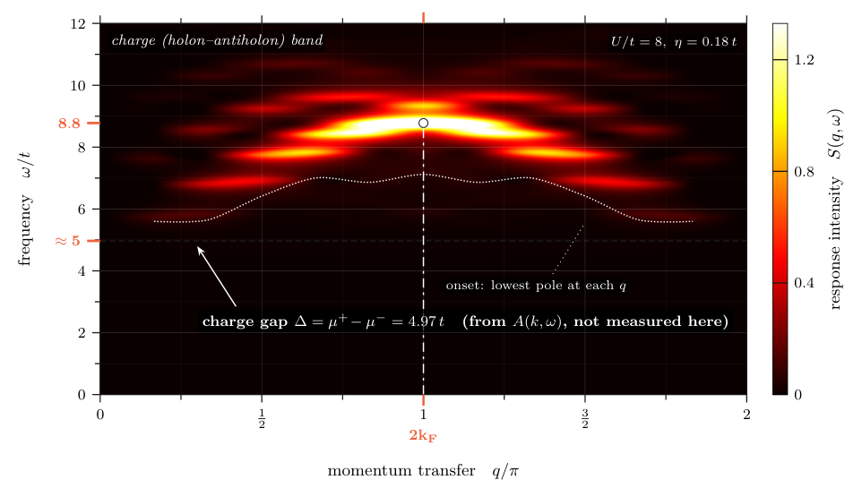
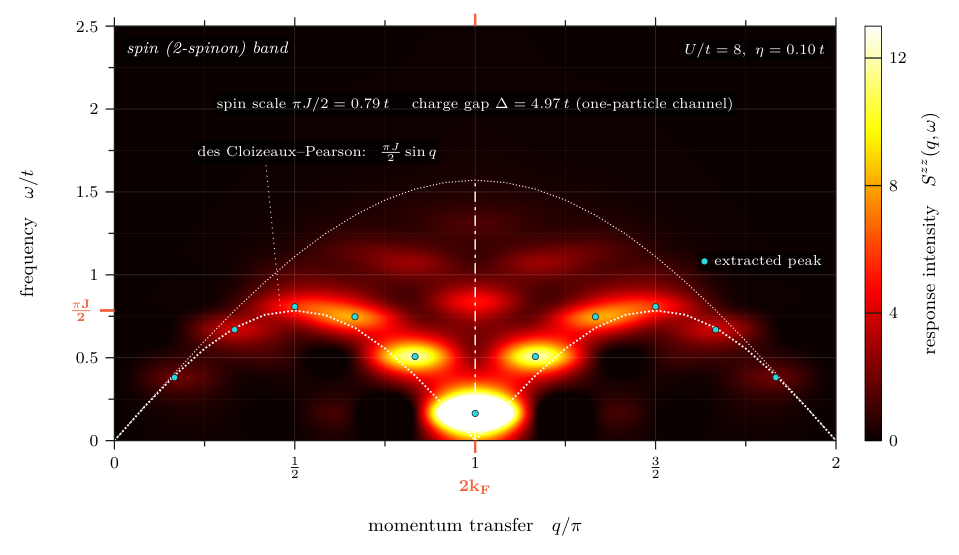
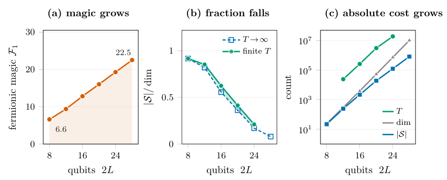
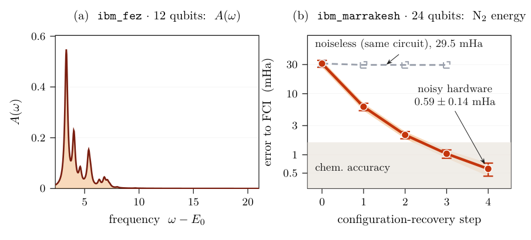
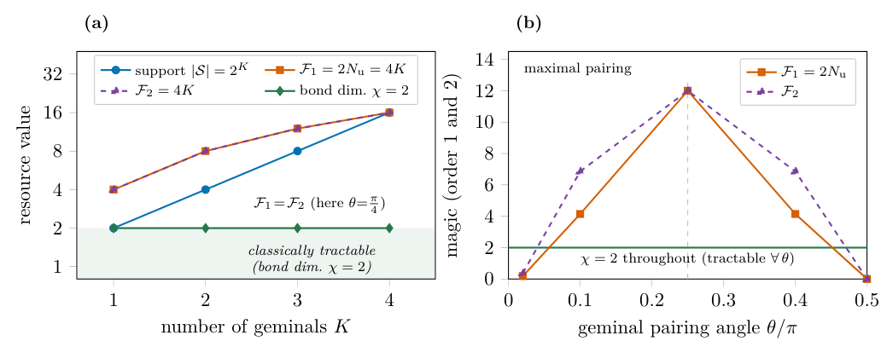
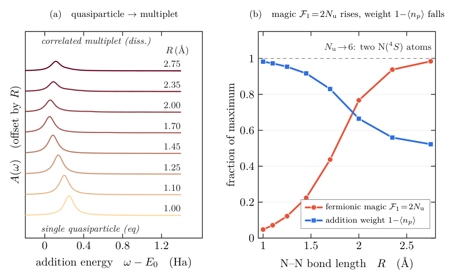

<div align="center">

# Captured weight and boundary leakage bound the error of sample-based spectral functions

### *a two-sided, a posteriori bound — and an honest account of where it is vacuous*

**Nicolás Bonilla Vargas** &nbsp;[](https://orcid.org/0009-0006-6155-4391)

[](https://arxiv.org/abs/2608.16436)
[](https://doi.org/10.5281/zenodo.22967220)
[](paper/main.pdf)
[](LICENSE)
[](LICENSE)
[](https://github.com/nicolasbonilla/dynamical-spectral-functions-sqd)
[](requirements.txt)
[](docs/REPRODUCE.md)

</div>

> **One sentence.** Sample-based quantum diagonalization is moving from energies to dynamics; given the
> subspace the shots populated, we prove a **two-sided bound on the relative `L₁` error** of the
> spectral function built on it — at least `1−w`, at most `(1+√w)(√(1−w) + Λ̂(η)/η)`, with `w` the
> captured Born weight and `Λ̂` the normalized coupling of `H` across the subspace boundary at
> resolution `η`, computable from the Ritz vectors in hand. **Shots buy the first term down, not the
> second.**

> **And the retraction, in the same breath.** Versions 1–2 of this preprint claimed a *weight-only*
> bound. An analytic counterexample forces its constant to the trivial value, and it is **withdrawn**.
> On Hubbard sectors up to dimension 10 306 296 the replacement is worse than the trivial bound at
> every published fraction, at all five sizes, by factors of 1.66–8.61 — **so those reconstructions are
> uncertified**. What survives is a calibration: over sixteen `(L,η)` cells whose true errors span five
> decades, the bound crosses the trivial one at a true relative error of `1.2–7.3×10⁻³`, median
> `2.8×10⁻³`, computed without the answer. **Yet a two-constant rule in `1−w`, fitted out of sample,
> localizes that error more tightly on 11 of 14 train/test splits, so no superiority is claimed for the
> bound as an error tracker.** **No quantum advantage is claimed.**

**Repository:** <https://github.com/nicolasbonilla/dynamical-spectral-functions-sqd> — this URL is the
one the manuscript's data-availability statement points to. It is also in
[`CITATION.cff`](CITATION.cff).

This repository is the **reproduction record** of the paper: every number and every figure traces to a
script and a data file, except the declared gaps below, listed in [`docs/REPRODUCE.md`](docs/REPRODUCE.md) and
[`docs/FILE_INDEX.md`](docs/FILE_INDEX.md), and `python src/verify.py` recomputes the physics and checks
the deposit against it. **It is not a claim that everything re-runs here.** What a clean clone reaches —
and the parts it does not, because they need `pyscf`, an IBM Quantum account, or a figure step that is
not deposited — is tabulated, measured rather than asserted, at the end of
[`docs/REPRODUCE.md`](docs/REPRODUCE.md), and the gaps are enumerated in
[`docs/KNOWN_DISCREPANCIES.md`](docs/KNOWN_DISCREPANCIES.md). The statement that may be published about
all this is [`docs/DATA_AVAILABILITY.md`](docs/DATA_AVAILABILITY.md).

> **Companion works.** Review — *Machine learning for sample-based quantum diagonalization: a review of
> generative configuration recovery and the classical-simulability frontier* ([arXiv:2608.05314](https://arxiv.org/abs/2608.05314)).
> Method — *Reconstruction-independent moment tests for quantum-computed dynamical spectra* (in preparation).

---

## Figure gallery

| Momentum-resolved `A(k,ω)` (exact Mott map) | The resource thesis (74 rows, 71 distinct exact states) |
|:---:|:---:|
|  |  |
| **Charge structure factor `S(q,ω)`, L=12** | **Spin structure factor `S^zz(q,ω)`, L=12** |
|  |  |
| **Scaling: fraction falls, absolute cost grows** | **IBM Heron hardware (two runs, stated at their size)** |
|  |  |
| **The geminal witness: magic large, `χ = 2`** | **N₂ dissociation hero (`F₁ = 2Nᵤ`)** |
|  |  |

<div align="center"><em>Both collective channels come from the <strong>same sampling primitive</strong>. At L=12 each is a set of discrete poles, so the paper uses the spin–charge contrast (spin scale πJ/2≈0.79t, far below the charge gap Δ≈4.97t) as a check of the method, not as a result, and calls neither channel a continuum or gapless (Sec. VIII).</em></div>

---

## What the paper shows

1. **A two-sided, a posteriori error bound for sampled spectral functions.** One sampling primitive,
   four channels — `A(ω)`, `A(k,ω)`, `S(q,ω)`, `S^zz(q,ω)` — with **no Hadamard tests or controlled
   unitaries**, and a certificate computed from the Ritz vectors the run already produced. The upper
   branch splits the error into what shots can fix (captured weight `1−w`) and what they cannot
   (boundary leakage `Λ̂(η)/η`).
2. **A retraction, and what replaces it.** The weight-only bound of versions 1–2 is withdrawn: an
   analytic counterexample forces its constant to the trivial value, and none of 606 test subspaces
   violates the replacement. The obstruction is structural — at `L=8` the probe's Krylov space touches
   every determinant of the sector.
3. **An obstruction theorem for one-body magic.** The fermionic AntiFlatness collapses to a single
   1-RDM invariant `F₁ = 4 tr[γ(1−γ)] = 2Nᵤ`. Being an orbital-rotation (Gaussian) invariant, it is
   **provably decoupled** from the basis-dependent support `|S|`: constant along an orbit on which the
   support runs from `O(K)` to `2^K` at bond dimension 2. Within each of six `(L,N)` strata its rank
   correlation with the support is exactly `−1` (exact `p = 3.3×10⁻¹³`); **both pooled coefficients are
   withdrawn** as a Simpson reversal.
4. **Validation, measured prices, and hardware.** Exact diagonalization across Hubbard chains and a
   nineteen-molecule suite; the three prices (support, resolution, shots) measured rather than
   asserted; and two real **IBM Heron** runs.

**Hardware, stated at its size.** Two runs were executed on IBM Heron processors. On `ibm_fez` (L=6
Hubbard, 12 qubits), post-selection retained all 300 determinants of the sector, so the reconstructed
A(ω) equals the exact one *by coverage*: an identity, not a fidelity measurement. The notebook read the
bitstrings in reversed qubit order, so every retained shot is a device error: a noiseless simulation of
the same circuits keeps 0 of 350 000 shots under that reading and all of them under the correct one
(`src/hw_bitorder_check.py`; `docs/KNOWN_DISCREPANCIES.md` §30). On `ibm_marrakesh`
(stretched N₂, CAS(10e,12o), 24 qubits), recovery over 8 seeds reaches 0.59 ± 0.14 mHa of the exact
active-space energy, below the 29.5 mHa of a noiseless simulation of the same circuit. The recovered
subspace sizes on which that comparison turns were not stored, so the record cannot say whether device
noise helps. Neither run says anything about accuracy at incomplete coverage.

---

## Repository structure

```
.
├── src/                       # 63 computation & figure scripts, plus 28 in src/frontier/ (the C3 sweep); run from repo root as `python src/X.py`
│   ├── verify.py              #   the adversarial guardian: recomputes the physics, then checks the deposit
│   ├── check_figures.py       #   do the committed generators still produce the committed fragments?
│   ├── check_provenance.py    #   does the documentation still describe the manuscript? (derives it from main.tex)
│   ├── akw_lanczos.py …       #   exact-diagonalization engines + spectral/resource/scaling compute
│   ├── make_*.py              #   one data-driven figure generator per figure (no hand-typed numbers)
│   └── recovered/             #   the generators of Figs. 6 and S5 and their compute, recovered 2026-09-26 (README inside)
├── data/                      # 38 datasets, plus data/c3_frontier/ (95 files), data/gflow_runs/ (20) and
│                              #   data/thm1iii_violation/ (the inputs of Fig. S5): every plotted number (*.json)
├── ckpt/                      # the L=14 ground-state checkpoint (94 MB) and ranking, with SHA-256 (deposited 2026-09-25)
├── notebooks/
│   ├── 00_Reproduce_Everything.ipynb   #   the v1–v2 narrated pipeline, kept as a record (needs pyscf)
│   ├── HW_LUCJ_N2_Heron_READY.ipynb    #   IBM Heron N₂ energy   (token SCRUBBED — see below)
│   └── Spectral_Heron.ipynb            #   IBM Heron A(ω)        (token SCRUBBED — see below)
├── paper/                     # the v3 manuscript: REVTeX 4.2 (aps, pra), one column for submission
│   ├── main.tex               #   preamble, abstract and the \input list
│   ├── sec_1.tex … sec_10.tex #   the ten sections of the main text
│   ├── sm_*.tex               #   nine Supplemental Material files: Secs. S1–S8 (sm_begin.tex opens the SM)
│   ├── sec_*_app.tex, app_*.tex#  Secs. S9–S16 of the Supplemental Material (the former appendices)
│   ├── carried/               #   nine one-float wrappers carried verbatim from v2
│   ├── figs/                  #   11 native fragments, 6 figure PDFs, 19 plotted .dat tables, captions
│   │   └── src/               #   the standalone sources of the 6 figure PDFs (deposited 2026-09-26)
│   ├── main.pdf               #   the compiled preprint (66 pp)
│   └── arxiv-submission.tar.gz#   the FROZEN arXiv v2 bundle — a record, never a source
├── _superseded/               # the v2-era manuscript, the five figures v3 withdrew and the v1 README thumbnails, kept for the trail
├── docs/
│   ├── REPRODUCE.md           #   figure/number → script → exact command, and what a clean clone cannot reach
│   ├── FILE_INDEX.md          #   every file, described, plus the orphan inventory
│   ├── FIGURE_PROVENANCE.md   #   figure → source → generator → data → job id
│   ├── KNOWN_DISCREPANCIES.md #   where running a script does NOT reproduce the deposit (read this)
│   ├── DATA_AVAILABILITY.md   #   the statement drafted for PRA, and the audit behind each sentence
│   ├── C3_FRONTIER.md         #   the C3 certificate-frontier sweep behind Sec. V, file by file
│   ├── ARXIV_SUBMISSION.md    #   how the v3 source package was built and submitted
│   └── img/                   #   README thumbnails, rendered from the v3 figures by make_thumbnails.py
├── .github/workflows/ci.yml   # CI: `make verify`, `make check-figures` and `make check-coherence` on every push
├── requirements.txt           # Python dependencies
├── Makefile                   # `make verify`, `make check-figures`, `make figures`, `make paper`, `make ci`
├── CITATION.cff               # citation metadata
├── .zenodo.json               # Zenodo deposit metadata
└── LICENSE                    # MIT (code) + CC-BY-4.0 (paper text, figures and data)
```

---

## Quick start

```bash
# 1. environment
python -m venv .venv && source .venv/bin/activate      # (Windows: .venv\Scripts\activate)
pip install -r requirements.txt

# 2. the adversarial guardian (~10 s, numpy/scipy only). It RECOMPUTES the physics
#    (Hubbard F₁/E₀ for both boundary conditions, the geminal witness) and then checks every
#    deposited artefact — figures, tables, .dat files and the abstract — against it.
python src/verify.py        # or: make verify   ->   PASS, plus a named list of open defects
#    It exits non-zero and names the defect if anything disagrees. The `[XFAIL]` lines it
#    prints are REAL open defects, claims and coverage gaps, deliberately visible.

# 2b. do the committed figures still come out of the committed generators? (see the caveat below)
python src/check_figures.py # or: make check-figures

# 2c. does the DOCUMENTATION still describe the manuscript? (derived from paper/main.tex)
python src/check_provenance.py          # add -v for the orphan inventory, --markdown for the table

# 3. the v1–v2 narrated pipeline, kept as a record (needs pyscf; NOT the v3 figure set)
jupyter notebook notebooks/00_Reproduce_Everything.ipynb    # or headless: make reproduce

# 4. regenerate a single data-driven figure fragment from its committed data
python src/make_decoupling_native.py    # -> paper/figs/fig_decoupling_native.tex

# 5. build the paper (needs a TeX distribution with REVTeX 4.2 and pgfplots ≥ 1.18)
make paper                              # -> paper/main.pdf
```

**How v3 was built and submitted:** see **[`docs/ARXIV_SUBMISSION.md`](docs/ARXIV_SUBMISSION.md)** (v3 was
submitted on 2026-09-25 from a package built by `src/build_arxiv_bundle.py`, and announces on
2026-09-28). **`paper/arxiv-submission.tar.gz` is the frozen snapshot of what was posted as v2 and must
never be re-uploaded**: 17 files in `paper/` have since moved ahead of it (17 files differ and 21 are
bundle-only), and the bundle still contains the two fabricated rows of `figs/sqw_edges.dat` and the
seven v2 body files the v3 sections replace. Run `python src/check_tarball.py` for the live comparison,
and see [`docs/KNOWN_DISCREPANCIES.md`](docs/KNOWN_DISCREPANCIES.md) §7.

---

## Reproducibility at a glance

*Measured 2026-09-19 unless the row says otherwise; the guardian rows were re-measured on 2026-09-26.*

| Layer | Reproducible here? | How |
|---|---|---|
| **The guardian** | ✅ **PASS** — 872 checks, 0 failures, 9 889 numeric assertions, 5 xfail, 0 xpass, 2 skips *(re-measured 2026-09-26 after the hardware bit-order check was added: 872 pass, 0 fail, 9 889 assertions, 5 xfail, 2 skips, ~30 s)* | `python src/verify.py` (or `make verify`) |
| **The documentation** | ✅ **PASS** — derived from `paper/main.tex`: 60 source files, 34 floats, 17 figures, 17 tables *(2026-09-26)* | `python src/check_provenance.py` |
| **Manuscript coherence** | ✅ **PASS** — 10 cross-section claims, 20 synthetic controls, all 20 fire *(2026-09-19)*. New that day, because the other three guardians were green while seven sections contradicted each other: they compare a printed number against a deposited file, not a claim against a claim | `python src/check_coherence.py` |
| **The figure generators** | ✅ **PASS on 19 artefacts from 8 generators** *(2026-09-26)* — the six of 2026-09-19 and the two recovered that day into `src/recovered/`; one provenance-timestamp comment line of the Fig. 6 fragment is normalised, and the run says so. Measured with four negative controls in `KNOWN_DISCREPANCIES.md` §29. (Until 2026-09-19 one of the first eight artefacts was compared with a copy of itself; §25.) | `python src/check_figures.py` |
| **Exact diagonalization, numpy/scipy only** (`A(ω)`, `A(k,ω)`, `S(q,ω)`, `S^zz`, the two gaps, the χ–\|S\| resource map, the geminal witness, the scaling) | ✅ **verified locally**, minutes | `python src/<script>.py`; see `docs/REPRODUCE.md` |
| **The 19-molecule suite** | ⚠️ runs, but needs `pyscf`; **untested in this pass**, so the molecular checks are transcription checks, not recomputations | `python src/n19_suite.py` etc. |
| **The v1–v2 narrated notebook** | ⚠️ **a record, not the v3 reproduction path** — it reproduces the v1–v2 figure set, several of which v3 withdrew, needs `pyscf` and was **not run**; use `src/verify.py` and `docs/REPRODUCE.md` | `notebooks/00_Reproduce_Everything.ipynb` |
| **Matrix-free scaling** to 28 qubits | ✅ (RAM-staged, resumable) | `src/scaling_lanczos_mf.py` |
| **Figures** | ⚠️ **8 of 17 are byte-for-byte guarded** (Figs. 2, 3, 6, 9, S2, S3, S8, and the ten tables of S5). Nine are not: four have no deposited generator (Figs. 1, S1, S4, 5), and five ship as a PDF (Figs. 4, 7, 8, S6, S7). The standalone sources of all six PDF figures (Fig. 1 included) are deposited since 2026-09-26 and recompile pixel-identically, but no script guards them, and two of their rasters were recoloured by a step that is not deposited. *(Until 2026-09-26: 6 of 17, and the generators of Figs. 6 and S5 were not in the tree.)* | inventory in [`docs/FIGURE_PROVENANCE.md`](docs/FIGURE_PROVENANCE.md) |
| **IBM Heron hardware runs** | ⚠️ needs an IBM Quantum account, and the jobs are closed | `notebooks/` (tokens scrubbed; **no raw counts are deposited**) |

> **`paper/main.pdf` is the v3 manuscript** as compiled on 2026-09-25: 66 pages, one column, a 25-page
> main text followed by the Supplemental Material. The build log shows 0 errors, 0 undefined references
> or citations and 0 overfull `\hbox` (two overfull `\vbox`, of 5.8 pt and 12.1 pt). It differs from the
> source package submitted to arXiv as v3 only in two later edits: the Zenodo DOI in the
> data-availability statement and in the repository reference (which now carries the current title),
> and the sentence noting that the L=14 checkpoint is deposited. Run `make paper` after any further
> source edit.
>
> **CI.** `.github/workflows/ci.yml` runs `make verify` and `make check-figures` on every push, and has
> done so since 2026-09-19 (see the Actions tab). `make check-coherence` was added as a third job on
> 2026-09-26 and runs from the next push on, so that the workflow runs what `make ci` runs.

**Data availability:** the statement drafted for Physical Review A, and the audit of what the deposit
does and does not support, are in [`docs/DATA_AVAILABILITY.md`](docs/DATA_AVAILABILITY.md).

The two hardware runs are the **entirety** of the quantum hardware used; every other result is an exact
classical simulation reproducible from this repository.

---

## 🔒 Security note (please read before pushing)

The hardware notebooks in `notebooks/` have had the author's **IBM Quantum API token and instance CRN
removed** and replaced with `<YOUR_IBM_QUANTUM_TOKEN>` / `<YOUR_IBM_QUANTUM_INSTANCE_CRN>` placeholders.
To run them, insert **your own** credentials (never commit them — use `QiskitRuntimeService.save_account`
locally or an environment variable). This repository contains **no secrets**.

---

## Citation

If you use this work, please cite it (see [`CITATION.cff`](CITATION.cff)):

```bibtex
@article{BonillaVargas2026CapturedWeight,
  title   = {Captured weight and boundary leakage bound the error of
             sample-based spectral functions},
  author  = {Bonilla Vargas, Nicol\'as},
  journal = {arXiv preprint arXiv:2608.16436},
  eprint        = {2608.16436},
  archivePrefix = {arXiv},
  primaryClass  = {quant-ph},
  doi     = {10.48550/arXiv.2608.16436},
  year    = {2026}
}
```

and, for the code and data, the archived deposit (this DOI always resolves to the latest version):

```bibtex
@software{BonillaVargas2026Repository,
  title     = {Captured weight and boundary leakage bound the error of
               sample-based spectral functions --- reproduction repository},
  author    = {Bonilla Vargas, Nicol\'as},
  publisher = {Zenodo},
  doi       = {10.5281/zenodo.22967220},
  url       = {https://doi.org/10.5281/zenodo.22967220},
  year      = {2026}
}
```

## License

- **Code** (`*.py`, `notebooks/`, `Makefile`): [MIT](LICENSE).
- **Paper text, figures and data** (`paper/`, `data/`): [CC-BY-4.0](LICENSE).
